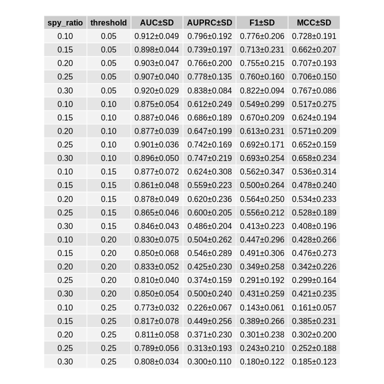
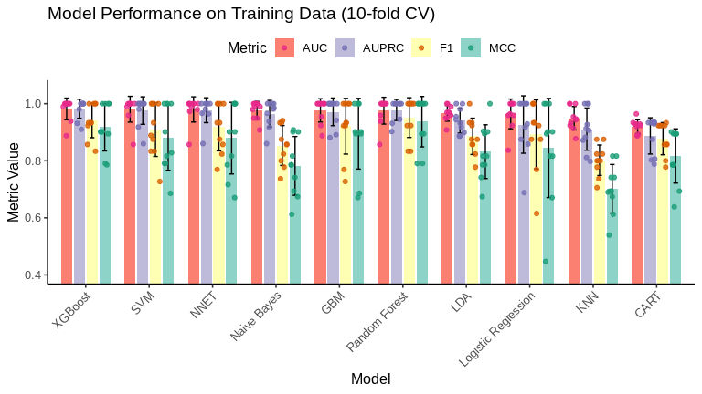
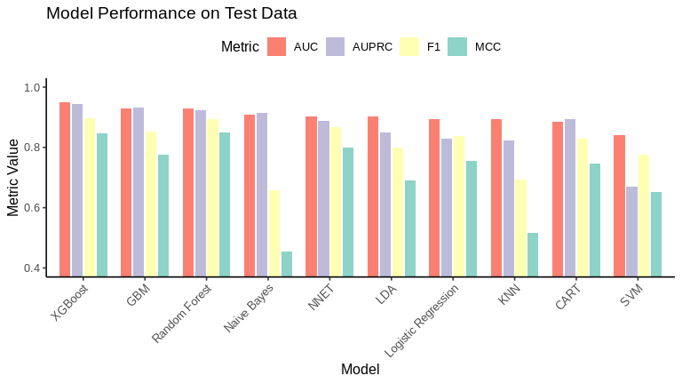
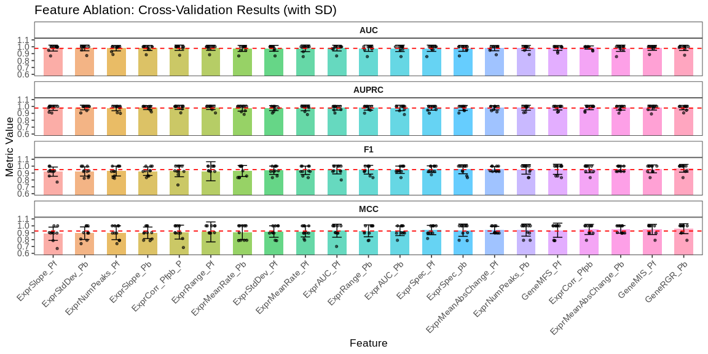
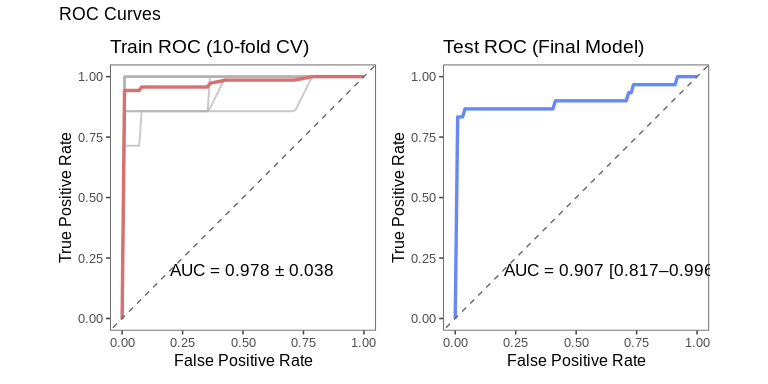
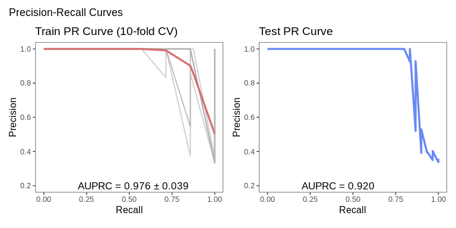
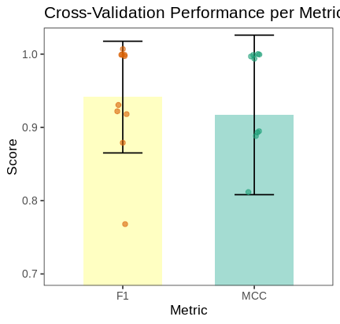
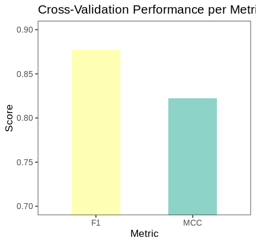
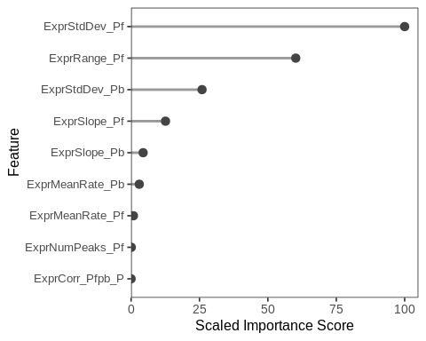

Introduction
================

<p style="font-size: 130%; font-weight: bold; color: black; line-height: 1.6; text-align: justify;">

This is a quick walkthrough of the MRS pipeline for prioritizing
metabolism-related genes in <em>Plasmodium falciparum</em>. Starting
from a precompiled feature matrix, this script demonstrates how to apply
Spy-based PU learning, compare classification models, perform optional
feature selection, and train the final predictive model. The example
dataset includes labeled positive genes and unlabeled candidates for
binary classification.

</p>

# 1\. Environment Setup and Data Loading

## 1.1. (Optional) Install MRS package locally

``` r
# devtools::install_local("../MRS_Package/MRS_1.0.0.tar.gz")
```

## 1.2. Load required libraries

``` r
library(MRS)
library(magrittr)
library(data.table)
library(caret)
library(e1071)
library(pROC)
library(PRROC)
library(parallel)
library(doParallel)
library(tidyr)
library(dplyr)
library(ggpubr)
library(ggplot2)
library(RColorBrewer)
library(egg)
library(ComplexHeatmap)
library(Seurat)
```

## 1.3. Load feature table and extract selected columns

``` r
Feature_ori <- readRDS("../Data/03_GeneInfo_forML.Rds")%>%as.data.table()
Feature <- Feature_ori[, c(7:28)]
```

## 1.4. Preview feature matrix

``` r
# The feature matrix contains 5720 rows and 22 columns. The first column, named 'Label', is the class label: 1 indicates a positive sample, and all others are considered unlabeled.
# The remaining 21 columns represent numerical features used for training. Make sure all feature columns are numeric; if not, categorical variables should be properly encoded before modeling.
Feature[1:10,1:10]
```

# 2\. Reliable Negative Identification via Spy PU-Learning

## 2.1. Impute missing values with median

``` r
Feature <- Impute_with_label(Feature,method = "median")%>%as.data.table()
```

## 2.2. Tune Spy PU-learning parameters

### 2.2.1. Run PU-learning parameter tuning

``` r
p <- Feature[Feature$Label == 1, ]
p <- p[, -1]
u <- Feature[Feature$Label != 1, ]
u <- u[, -1]
Parameter_select <- Tune_spy_pu(p_data = p, u_data = u, pu_repeats = 10, cv_folds = 3, seed = 123)
```

    ##   |                                                                                                                                                                                            |                                                                                                                                                                                    |   0%  |                                                                                                                                                                                            |=======                                                                                                                                                                             |   4%  |                                                                                                                                                                                            |==============                                                                                                                                                                      |   8%  |                                                                                                                                                                                            |======================                                                                                                                                                              |  12%  |                                                                                                                                                                                            |=============================                                                                                                                                                       |  16%  |                                                                                                                                                                                            |====================================                                                                                                                                                |  20%  |                                                                                                                                                                                            |===========================================                                                                                                                                         |  24%  |                                                                                                                                                                                            |==================================================                                                                                                                                  |  28%  |                                                                                                                                                                                            |==========================================================                                                                                                                          |  32%  |                                                                                                                                                                                            |=================================================================                                                                                                                   |  36%  |                                                                                                                                                                                            |========================================================================                                                                                                            |  40%  |                                                                                                                                                                                            |===============================================================================                                                                                                     |  44%  |                                                                                                                                                                                            |======================================================================================                                                                                              |  48%  |                                                                                                                                                                                            |==============================================================================================                                                                                      |  52%  |                                                                                                                                                                                            |=====================================================================================================                                                                               |  56%  |                                                                                                                                                                                            |============================================================================================================                                                                        |  60%  |                                                                                                                                                                                            |===================================================================================================================                                                                 |  64%  |                                                                                                                                                                                            |==========================================================================================================================                                                          |  68%  |                                                                                                                                                                                            |==================================================================================================================================                                                  |  72%  |                                                                                                                                                                                            |=========================================================================================================================================                                           |  76%  |                                                                                                                                                                                            |================================================================================================================================================                                    |  80%  |                                                                                                                                                                                            |=======================================================================================================================================================                             |  84%  |                                                                                                                                                                                            |==============================================================================================================================================================                      |  88%  |                                                                                                                                                                                            |======================================================================================================================================================================              |  92%  |                                                                                                                                                                                            |=============================================================================================================================================================================       |  96%  |                                                                                                                                                                                            |====================================================================================================================================================================================| 100%

### 2.2.2. Visualize tuning results as a table

``` r
df <- Parameter_select
df %<>% mutate(
  "AUC±SD" = sprintf("%.3f±%.3f", AUC, AUC_SD),
  "AUPRC±SD" = sprintf("%.3f±%.3f", AUPRC, AUPRC_SD),
  "F1±SD" = sprintf("%.3f±%.3f", F1, F1_SD),
  "MCC±SD" = sprintf("%.3f±%.3f", MCC, MCC_SD)
)
display_df <- df[, c("spy_ratio","threshold","AUC±SD","AUPRC±SD","F1±SD","MCC±SD")]
p_table <- tableGrob(display_df, rows = NULL)
#
grid.newpage()
grid.draw(p_table)
```

<!-- -->

## 2.3. Identify reliable negatives and prepare merged dataset

``` r
NewData <- Identify_reliable_negatives(Feature, spy_ratio =  0.3, threshold_quantile = 0.05,seed = 123)
```

    ##   |                                                                                                                                                                                            |                                                                                                                                                                                    |   0%  |                                                                                                                                                                                            |============================================================                                                                                                                        |  33%  |                                                                                                                                                                                            |========================================================================================================================                                                            |  67%  |                                                                                                                                                                                            |====================================================================================================================================================================================| 100%

``` r
Feature%<>%as.data.frame()
Feature <- Feature[,-which(colnames(Feature)=="Label")]
Feature$Name <- Feature_ori$ID
Allres <- merge(NewData,Feature)
Allres%<>%as.data.frame()
Allres <- Allres[ , -which(colnames(Allres)=="Name")]
anyNA(Allres)
```

    ## [1] FALSE

# 3\. Model Training and Evaluation

## 3.1. Prepare training and test sets

``` r
prepared_data <- Prepare_classification_data(Allres, test_size = 0.3, seed = 123)
```

    ##   |                                                                                                                                                                                            |                                                                                                                                                                                    |   0%  |                                                                                                                                                                                            |==========================================================================================                                                                                          |  50%  |                                                                                                                                                                                            |====================================================================================================================================================================================| 100%

## 3.2. Train multiple classification models with cross-validation

``` r
Multi_models <- Train_multiple_models(prepared_data = prepared_data , n_folds = 10,n_repeats = 1, parallel = TRUE, n_cores=10, seed = 123)
```

    ## Enabling parallel processing: 10 cores

    ##   |                                                                                                                                                                                            |                                                                                                                                                                                    |   0%
    ## Starting training...
    ## 
    ## Training model: LDA (1/10)
    ## Aggregating results
    ## Fitting final model on full training set
    ## Completed
    ##   |                                                                                                                                                                                            |==================                                                                                                                                                                  |  10%
    ## Training model: CART (2/10)
    ## Aggregating results
    ## Selecting tuning parameters
    ## Fitting cp = 0 on full training set
    ## Completed
    ##   |                                                                                                                                                                                            |====================================                                                                                                                                                |  20%
    ## Training model: Random Forest (3/10)
    ## Aggregating results
    ## Selecting tuning parameters
    ## Fitting mtry = 2 on full training set
    ## Completed
    ##   |                                                                                                                                                                                            |======================================================                                                                                                                              |  30%
    ## Training model: GBM (4/10)
    ## Aggregating results
    ## Selecting tuning parameters
    ## Fitting n.trees = 50, interaction.depth = 1, shrinkage = 0.1, n.minobsinnode = 10 on full training set
    ## Completed
    ##   |                                                                                                                                                                                            |========================================================================                                                                                                            |  40%
    ## Training model: Naive Bayes (5/10)
    ## Aggregating results
    ## Selecting tuning parameters
    ## Fitting laplace = 0, usekernel = FALSE, adjust = 1 on full training set
    ## Completed
    ##   |                                                                                                                                                                                            |==========================================================================================                                                                                          |  50%
    ## Training model: SVM (6/10)
    ## Aggregating results
    ## Selecting tuning parameters
    ## Fitting sigma = 0.0633, C = 0.5 on full training set
    ## Completed
    ##   |                                                                                                                                                                                            |============================================================================================================                                                                        |  60%
    ## Training model: KNN (7/10)
    ## Aggregating results
    ## Selecting tuning parameters
    ## Fitting k = 9 on full training set
    ## Completed
    ##   |                                                                                                                                                                                            |==============================================================================================================================                                                      |  70%
    ## Training model: Logistic Regression (8/10)
    ## Aggregating results
    ## Fitting final model on full training set
    ## Completed
    ##   |                                                                                                                                                                                            |================================================================================================================================================                                    |  80%
    ## Training model: NNET (9/10)
    ## Aggregating results
    ## Selecting tuning parameters
    ## Fitting size = 1, decay = 1e-04 on full training set
    ## Completed
    ##   |                                                                                                                                                                                            |==================================================================================================================================================================                  |  90%
    ## Training model: XGBoost (10/10)
    ## Aggregating results
    ## Selecting tuning parameters
    ## Fitting nrounds = 50, max_depth = 1, eta = 0.4, gamma = 0, colsample_bytree = 0.6, min_child_weight = 1, subsample = 0.5 on full training set
    ## Completed
    ##   |                                                                                                                                                                                            |====================================================================================================================================================================================| 100%

## 3.3. Evaluate model performance on training set

### 3.3.1. Compute per-fold training metrics

``` r
#This function outputs a summary of model performance on the training set based on repeated cross-validation. Specifically, it reports the average and standard deviation (±SD) of four key metrics for each classification model: AUC (Area Under the ROC Curve), AUPRC (Area Under the Precision-Recall Curve), F1 score, and MCC (Matthews Correlation Coefficient). The models are automatically ranked by their mean AUC in descending order to highlight the best-performing methods.
Model_perf_Train <- Evaluate_train_performance(trained_models = Multi_models, prepared_data = prepared_data, seed = 123)
```

    ## 
    ## Training Set Model Performance Ranking (by AUC):
    ## 1. XGBoost: AUC=0.982 ± 0.038, AUPRC=0.982 ± 0.033, F1=0.941 ± 0.061, MCC=0.917 ± 0.083
    ## 2. SVM: AUC=0.981 ± 0.045, AUPRC=0.976 ± 0.048, F1=0.909 ± 0.094, MCC=0.881 ± 0.115
    ## 3. NNET: AUC=0.980 ± 0.044, AUPRC=0.977 ± 0.044, F1=0.919 ± 0.084, MCC=0.879 ± 0.126
    ## 4. Naive Bayes: AUC=0.977 ± 0.031, AUPRC=0.965 ± 0.047, F1=0.854 ± 0.070, MCC=0.782 ± 0.103
    ## 5. GBM: AUC=0.977 ± 0.041, AUPRC=0.971 ± 0.048, F1=0.921 ± 0.098, MCC=0.895 ± 0.124
    ## 6. Random Forest: AUC=0.976 ± 0.047, AUPRC=0.978 ± 0.037, F1=0.951 ± 0.070, MCC=0.937 ± 0.088
    ## 7. LDA: AUC=0.966 ± 0.028, AUPRC=0.940 ± 0.044, F1=0.886 ± 0.064, MCC=0.832 ± 0.094
    ## 8. Logistic Regression: AUC=0.964 ± 0.052, AUPRC=0.927 ± 0.101, F1=0.892 ± 0.121, MCC=0.845 ± 0.174
    ## 9. KNN: AUC=0.949 ± 0.041, AUPRC=0.911 ± 0.074, F1=0.802 ± 0.053, MCC=0.702 ± 0.085
    ## 10. CART: AUC=0.920 ± 0.024, AUPRC=0.887 ± 0.064, F1=0.877 ± 0.056, MCC=0.817 ± 0.095

### 3.3.2. Process and organize training performance results

``` r
per_fold_metrics <- Model_perf_Train$per_fold_metrics
#
fold_data_list <- lapply(names(per_fold_metrics), function(model_name) {
  df <- per_fold_metrics[[model_name]]
  df$Model <- model_name
  df <- as.data.table(df)

  #
  df[, AUC := as.numeric(AUC)]
  df[, AUPRC := as.numeric(AUPRC)]
  df[, F1 := as.numeric(F1)]
  df[, MCC := as.numeric(MCC)]

  return(df)
})

#
fold_data <- rbindlist(fold_data_list)

#
long_data <- pivot_longer(fold_data, cols = c(AUC, AUPRC, F1, MCC),
                          names_to = "Metric", values_to = "Value")

#
summary_stats <- long_data %>%
  group_by(Model, Metric) %>%
  summarise(mean_val = mean(Value, na.rm = TRUE),
            sd_val = sd(Value, na.rm = TRUE),
            .groups = 'drop')

#
auc_order <- summary_stats %>%
  filter(Metric == "AUC") %>%
  arrange(desc(mean_val)) %>%
  pull(Model)

long_data$Model <- factor(long_data$Model, levels = auc_order)
summary_stats$Model <- factor(summary_stats$Model, levels = auc_order)
```

### 3.3.3. Visualize training performance across models

``` r
set.seed(123)
ggplot() +
  geom_bar(data = summary_stats, aes(x = Model, y = mean_val, fill = Metric),
           stat = "identity", position = position_dodge(width = 0.8), width = 0.7) +

  geom_errorbar(data = summary_stats,
                aes(x = Model, ymin = mean_val - sd_val, ymax = mean_val + sd_val, group = Metric),
                position = position_dodge(width = 0.8), width = 0.3, color = "black") +

  geom_jitter(data = long_data,
              aes(x = Model, y = Value, color = Metric),
              position = position_jitterdodge(jitter.width = 0.15, dodge.width = 0.8),
              size = 1.5, alpha = 0.8) +

  labs(title = "Model Performance on Training Data (10-fold CV)", y = "Metric Value", x = "Model") +
  theme_classic2(base_size = 12) +
  theme(axis.text.x = element_text(angle = 45, hjust = 1),
        legend.position = "top") +
  scale_fill_brewer(palette = "Set3",direction = -1) +
  scale_color_brewer(palette = "Dark2",direction = -1)+
  coord_cartesian(ylim = c(0.4, 1.05))
```

<!-- -->

## 3.4. Evaluate model performance on test set

### 3.4.1. Compute test set metrics

``` r
#This function outputs a summary of model performance on the test set based on repeated cross-validation. Specifically, it reports the average and standard deviation (±SD) of four key metrics for each classification model: AUC (Area Under the ROC Curve), AUPRC (Area Under the Precision-Recall Curve), F1 score, and MCC (Matthews Correlation Coefficient). The models are automatically ranked by their mean AUC in descending order to highlight the best-performing methods.
Model_perf_Test <- Evaluate_test_performance(trained_models = Multi_models, prepared_data = prepared_data, seed = 123)
```

    ## 
    ## Test Set Model Performance Ranking (by AUC):
    ## 1. XGBoost: AUC=0.950, AUPRC=0.945, F1=0.897, MCC=0.848
    ## 2. GBM: AUC=0.930, AUPRC=0.932, F1=0.852, MCC=0.776
    ## 3. Random Forest: AUC=0.928, AUPRC=0.923, F1=0.893, MCC=0.849
    ## 4. Naive Bayes: AUC=0.909, AUPRC=0.914, F1=0.658, MCC=0.453
    ## 5. NNET: AUC=0.903, AUPRC=0.889, F1=0.867, MCC=0.799
    ## 6. LDA: AUC=0.902, AUPRC=0.849, F1=0.800, MCC=0.691
    ## 7. Logistic Regression: AUC=0.894, AUPRC=0.829, F1=0.839, MCC=0.754
    ## 8. KNN: AUC=0.894, AUPRC=0.822, F1=0.693, MCC=0.515
    ## 9. CART: AUC=0.885, AUPRC=0.894, F1=0.828, MCC=0.745
    ## 10. SVM: AUC=0.840, AUPRC=0.671, F1=0.776, MCC=0.652

### 3.4.2. Process and organize test performance results

``` r
test_summary <- Model_perf_Test$test_results

#
test_summary$AUC_num <- as.numeric(test_summary$AUC)
test_summary$AUPRC_num <- as.numeric(test_summary$AUPRC)
test_summary$F1_num <- as.numeric(test_summary$F1)
test_summary$MCC_num <- as.numeric(test_summary$MCC)

#
long_test_data <- pivot_longer(test_summary, cols = c(AUC_num, AUPRC_num, F1_num, MCC_num),
                          names_to = "Metric", values_to = "Value")

#
long_test_data$Metric <- recode(long_test_data$Metric,
                                "AUC_num" = "AUC",
                                "AUPRC_num" = "AUPRC",
                                "F1_num" = "F1",
                                "MCC_num" = "MCC")

#
auc_order <- test_summary %>%
  arrange(desc(AUC_num)) %>%
  pull(Model)

#
long_test_data$Model <- factor(long_test_data$Model, levels = auc_order)
```

### 3.4.3. Visualize test performance across models

``` r
ggplot() +
  geom_bar(data = long_test_data, aes(x = Model, y = Value, fill = Metric),
           stat = "identity", position = position_dodge(width = 0.8), width = 0.7) +
  labs(title = "Model Performance on Test Data",
       y = "Metric Value", x = "Model") +
  theme_classic2(base_size = 12) +
  theme(axis.text.x = element_text(angle = 45, hjust = 1),
        legend.position = "top") +
  scale_fill_brewer(palette = "Set3",direction = -1) +
  coord_cartesian(ylim = c(0.4, 1))
```

<!-- -->

# 4\. Feature Selection via Ablation Analysis

## 4.1. Perform ablation-based feature selection using cross-validation

``` r
feature_selection <-
  Feature_selection_ablation(
    prepared_data = prepared_data,
    model_name = "XGBoost",
    n_folds = 10,
    n_repeats = 1,
    seed = 123,
    sampling = "up",
    parallel = TRUE,
    n_cores = 8,
    threshold_auc = 0.01,
    threshold_auprc = 0.01,
    threshold_f1 = 0.01,
    threshold_mcc = 0.01,
    center = TRUE, scale = TRUE
  )
```

    ##   |                                                                                                                                                                                            |                                                                                                                                                                                    |   0%  |                                                                                                                                                                                            |=========                                                                                                                                                                           |   5%  |                                                                                                                                                                                            |=================                                                                                                                                                                   |  10%  |                                                                                                                                                                                            |==========================                                                                                                                                                          |  14%  |                                                                                                                                                                                            |==================================                                                                                                                                                  |  19%  |                                                                                                                                                                                            |===========================================                                                                                                                                         |  24%  |                                                                                                                                                                                            |===================================================                                                                                                                                 |  29%  |                                                                                                                                                                                            |============================================================                                                                                                                        |  33%  |                                                                                                                                                                                            |=====================================================================                                                                                                               |  38%  |                                                                                                                                                                                            |=============================================================================                                                                                                       |  43%  |                                                                                                                                                                                            |======================================================================================                                                                                              |  48%  |                                                                                                                                                                                            |==============================================================================================                                                                                      |  52%  |                                                                                                                                                                                            |=======================================================================================================                                                                             |  57%  |                                                                                                                                                                                            |===============================================================================================================                                                                     |  62%  |                                                                                                                                                                                            |========================================================================================================================                                                            |  67%  |                                                                                                                                                                                            |=================================================================================================================================                                                   |  71%  |                                                                                                                                                                                            |=========================================================================================================================================                                           |  76%  |                                                                                                                                                                                            |==================================================================================================================================================                                  |  81%  |                                                                                                                                                                                            |==========================================================================================================================================================                          |  86%  |                                                                                                                                                                                            |===================================================================================================================================================================                 |  90%  |                                                                                                                                                                                            |===========================================================================================================================================================================         |  95%  |                                                                                                                                                                                            |====================================================================================================================================================================================| 100%

## 4.2. Visualize performance impact of each feature using bar and error plots

``` r
feature_results <- feature_selection$feature_results
baseline_metrics <- feature_selection$baseline_metrics
#
fold_df <- rbindlist(lapply(names(feature_selection$per_fold_metrics), function(f) {
  df <- feature_selection$per_fold_metrics[[f]]
  df$Feature <- f
  return(df)
}))
fold_long <- melt(fold_df, id.vars = c("Feature", "Fold"), variable.name = "Metric", value.name = "Value")
fold_long <- merge(fold_long, feature_results[, c("Feature", "Retained", "Delta_MCC")], by = "Feature", all.x = TRUE)
fold_long$Feature <- factor(fold_long$Feature,
                            levels = feature_results[order(-feature_results$Retained, -feature_results$Delta_MCC), "Feature"])
summary_df <- fold_long[, .(
  Mean = mean(Value, na.rm = TRUE),
  SD = sd(Value, na.rm = TRUE)
), by = .(Feature, Metric)]
summary_df$Baseline <- baseline_metrics[as.character(summary_df$Metric)]

#
ggplot(summary_df, aes(x = Feature, y = Mean)) +
  geom_bar(stat = "identity", aes(fill = Feature), width = 0.6, alpha = 0.6) +
  geom_errorbar(aes(ymin = Mean - SD, ymax = Mean + SD), width = 0.3, linewidth = 0.5) +
  geom_point(data = fold_long, aes(x = Feature, y = Value),color="black",
             position = position_jitter(width = 0.15), size = 1.2, alpha = 0.6, inherit.aes = FALSE) +
  geom_hline(aes(yintercept = Baseline), linetype = "dashed", color = "red", linewidth = 0.6) +
  facet_wrap(~ Metric, scales = "free_y", nrow = 4) +
  theme_bw(base_size = 13) +
  theme(
    axis.text.x = element_text(angle = 45, hjust = 1),
    strip.text = element_text(face = "bold"),
    strip.background = element_rect(fill = "#f7f7f7"),
    legend.position = "none",
    panel.grid = element_blank(),
    strip.background.x =  element_rect(fill = "white")
  ) +
  labs(
    title = "Feature Ablation: Cross-Validation Results (with SD)",
    x = "Feature", y = "Metric Value"
  ) +
  coord_cartesian(ylim = c(0.6, 1.1))
```

<!-- -->

# 5\. Final Model Tuning, Evaluation, and Interpretation

## 5.1. Perform hyperparameter tuning using cross-validation

``` r
result <-
  Tune_model_eval(
    model_name = "XGBoost",
    prepared_data = feature_selection,
    n_folds = 10, n_repeats = 1,
    parallel = TRUE,n_cores = 15,
    tune_length = 500,search = "random", # "grid" "random"
    custom_grid = NULL,
    center = TRUE, scale = TRUE,
    sampling = "up",
    seed = 123
  )
```

    ## Parallel enabled: 15 cores
    ## Training model: XGBoost
    ## Model training complete.
    ## Evaluating each fold on training data...
    ##   |                                                                                                                                                                                            |                                                                                                                                                                                    |   0%  |                                                                                                                                                                                            |==================                                                                                                                                                                  |  10%  |                                                                                                                                                                                            |====================================                                                                                                                                                |  20%  |                                                                                                                                                                                            |======================================================                                                                                                                              |  30%  |                                                                                                                                                                                            |========================================================================                                                                                                            |  40%  |                                                                                                                                                                                            |==========================================================================================                                                                                          |  50%  |                                                                                                                                                                                            |============================================================================================================                                                                        |  60%  |                                                                                                                                                                                            |==============================================================================================================================                                                      |  70%  |                                                                                                                                                                                            |================================================================================================================================================                                    |  80%  |                                                                                                                                                                                            |==================================================================================================================================================================                  |  90%  |                                                                                                                                                                                            |====================================================================================================================================================================================| 100%
    ## Parallel cluster stopped.

## 5.2. Plot ROC curves for training and test sets

``` r
train_roc_list <- result$train_roc_list
test_roc <- result$test_roc
Plot_roc_curves(train_roc_list = train_roc_list,test_roc = test_roc)
```

<!-- -->

## 5.3. Plot Precision–Recall (PR) curves for training and test sets

``` r
train_pr_list <- result$train_pr_list
test_pr <- result$test_pr
Plot_pr_curves(train_pr_list = train_pr_list,test_pr = test_pr)
```

<!-- -->

## 5.4. Visualize per-fold cross-validation metrics (F1 and MCC)

``` r
Data <- result$train_metrics[,c("Fold","MCC","F1")]
Data%<>%melt()
```

    ## Warning in melt(.): The melt generic in data.table has been passed a data.frame and will attempt to redirect to the relevant reshape2 method; please note that reshape2 is deprecated,
    ## and this redirection is now deprecated as well. To continue using melt methods from reshape2 while both libraries are attached, e.g. melt.list, you can prepend the namespace like
    ## reshape2::melt(.). In the next version, this warning will become an error.

    ## Using Fold as id variables

``` r
summary_df <- Data %>%
  dplyr::group_by(variable) %>%
  summarise(
    Mean = mean(value, na.rm = TRUE),
    SD = sd(value, na.rm = TRUE)
  )
summary_df$variable%<>%as.character()
summary_df$variable <- factor(summary_df$variable,levels = c("F1","MCC"))
Data <- merge(Data, summary_df, by = "variable")

set.seed(123)
ggplot(summary_df, aes(x = variable, y = Mean, fill = variable)) +
  geom_col(width = 0.6, alpha = 0.8) +
  geom_errorbar(aes(ymin = Mean - SD, ymax = Mean + SD), width = 0.3, linewidth = 0.6) +
  geom_jitter(data = Data, aes(x = variable, y = value,color=variable),
              width = 0.05, size = 2, alpha = 0.6, inherit.aes = FALSE) +
  theme_bw(base_size = 13) +
  theme(
    legend.position = "none",panel.grid = element_blank(),
    axis.text.x = element_text(angle = 0, hjust = 0.5)
  ) +
  labs(
    title = "Cross-Validation Performance per Metric",
    x = "Metric", y = "Score"
  ) +
  coord_cartesian(ylim = c(0.7, 1.02))+
  scale_fill_manual(values = c("#FFFFB3","#8DD3C7"))+
  scale_color_manual(values = c("#1B9E77","#D95F02"))
```

<!-- -->

## 5.5. Summarize final test set performance metrics

``` r
Data <- result$final_test_metrics[,c("MCC","F1")]
Data%<>%melt()
```

    ## Warning in melt(.): The melt generic in data.table has been passed a data.frame and will attempt to redirect to the relevant reshape2 method; please note that reshape2 is deprecated,
    ## and this redirection is now deprecated as well. To continue using melt methods from reshape2 while both libraries are attached, e.g. melt.list, you can prepend the namespace like
    ## reshape2::melt(.). In the next version, this warning will become an error.

    ## No id variables; using all as measure variables

``` r
Data$variable%<>%as.character()
Data$variable <- factor(Data$variable,levels = c("F1","MCC"))
#
set.seed(123)
ggplot(Data, aes(x = variable, y = value, fill = variable)) +
  geom_bar(stat = "identity", width = .5) +
  theme_bw(base_size = 13) +
  theme(
    legend.position = "none",panel.grid = element_blank(),
    axis.text.x = element_text(angle = 0, hjust = 0.5)
  ) +
  labs(
    title = "Cross-Validation Performance per Metric",
    x = "Metric", y = "Score"
  ) +
  coord_cartesian(ylim = c(0.7, 0.9))+
  scale_fill_manual(values = c("#FFFFB3","#8DD3C7"))
```

<!-- -->

## 5.6. Plot feature importance from the final model

``` r
#
Feature_Importance <- result$feature_importance %>% as.data.table()
setorder(Feature_Importance, Overall)
Feature_Importance$Feature <- factor(Feature_Importance$Feature, levels = Feature_Importance$Feature)

#
segment_color <- "#999999"
point_color <- "#444444"

#
ggplot(Feature_Importance, aes(x = Overall, y = Feature)) +
  geom_segment(aes(x = 0, xend = Overall, y = Feature, yend = Feature),
               color = segment_color, size = 1) +
  geom_point(color = point_color, size = 3) +
  labs(
    x = "Scaled Importance Score",
    y = "Feature"
  ) +
  theme_bw(base_size = 13) +
  theme(
    axis.text.y = element_text(size = 10),
    axis.title = element_text(size = 12),
    plot.title = element_text(face = "bold", size = 14, hjust = 0.5),
    panel.grid.major = element_blank(),
    panel.grid.minor = element_blank()
  ) +
  scale_x_continuous(expand = expansion(mult = c(0, 0.05)))
```

<!-- -->

## 5.7. Access the best trained model

``` r
# The final optimized model trained with the best parameters can be accessed via result$best_model for downstream use or prediction.
result$best_model
```

    ## eXtreme Gradient Boosting 
    ## 
    ## 211 samples
    ##   9 predictor
    ##   2 classes: 'neg', 'pos' 
    ## 
    ## Pre-processing: centered (9), scaled (9) 
    ## Resampling: Cross-Validated (10 fold, repeated 1 times) 
    ## Summary of sample sizes: 190, 190, 189, 190, 190, 190, ... 
    ## Addtional sampling using up-sampling prior to pre-processing
    ## 
    ## Resampling results across tuning parameters:
    ## 
    ##   eta   max_depth  gamma  colsample_bytree  min_child_weight  subsample  nrounds  AUC        AUPRC      F1.F1      MCC      
    ##   0.01   6         0      0.8               1                 0.8        200      0.9663265  0.9665460  0.9140734  0.8856593
    ##   0.01   6         0      0.8               1                 0.8        300      0.9734694  0.9722967  0.9400641  0.9184775
    ##   0.01   6         0      0.8               1                 0.8        500      0.9693878  0.9722703  0.9400641  0.9184775
    ##   0.01   6         0      0.8               1                 1.0        200      0.9658163  0.9696077  0.9113462  0.8766252
    ##   0.01   6         0      0.8               1                 1.0        300      0.9698980  0.9730591  0.9244231  0.8982305
    ##   0.01   6         0      0.8               1                 1.0        500      0.9658163  0.9695312  0.9400641  0.9184775
    ##   0.01   6         0      0.8               3                 0.8        200      0.9673469  0.9666229  0.9167308  0.8848992
    ##   0.01   6         0      0.8               3                 0.8        300      0.9673469  0.9677618  0.9203205  0.8870110
    ##   0.01   6         0      0.8               3                 0.8        500      0.9724490  0.9739438  0.9269872  0.8968722
    ##   0.01   6         0      0.8               3                 1.0        200      0.9688776  0.9710826  0.9333974  0.9086163
    ##   0.01   6         0      0.8               3                 1.0        300      0.9709184  0.9734031  0.9357784  0.9081307
    ##   0.01   6         0      0.8               3                 1.0        500      0.9688776  0.9722215  0.9357784  0.9083616
    ##   0.01   6         0      1.0               1                 0.8        200      0.9704082  0.9676356  0.9140734  0.8856593
    ##   0.01   6         0      1.0               1                 0.8        300      0.9734694  0.9750505  0.9310897  0.9080917
    ##   0.01   6         0      1.0               1                 0.8        500      0.9744898  0.9765051  0.9400641  0.9184775
    ##   0.01   6         0      1.0               1                 1.0        200      0.9552296  0.9575087  0.9023718  0.8662394
    ##   0.01   6         0      1.0               1                 1.0        300      0.9608418  0.9640515  0.9180128  0.8864864
    ##   0.01   6         0      1.0               1                 1.0        500      0.9637755  0.9707155  0.9423718  0.9192329
    ##   0.01   6         0      1.0               3                 0.8        200      0.9744898  0.9713260  0.9167308  0.8848992
    ##   0.01   6         0      1.0               3                 0.8        300      0.9653061  0.9686083  0.9336538  0.9065026
    ##   0.01   6         0      1.0               3                 0.8        500      0.9683673  0.9722055  0.9346795  0.9074295
    ##   0.01   6         0      1.0               3                 1.0        200      0.9622449  0.9607682  0.8923718  0.8521527
    ##   0.01   6         0      1.0               3                 1.0        300      0.9627551  0.9662926  0.9280128  0.8975682
    ##   0.01   6         0      1.0               3                 1.0        500      0.9678571  0.9718677  0.9511630  0.9294761
    ##   0.01   6         1      0.8               1                 0.8        200      0.9688776  0.9648372  0.9071503  0.8781426
    ##   0.01   6         1      0.8               1                 0.8        300      0.9714286  0.9732335  0.9294580  0.9080200
    ##   0.01   6         1      0.8               1                 0.8        500      0.9693878  0.9725633  0.9400641  0.9184775
    ##   0.01   6         1      0.8               1                 1.0        200      0.9647959  0.9683751  0.9180128  0.8864864
    ##   0.01   6         1      0.8               1                 1.0        300      0.9647959  0.9695600  0.9180128  0.8864864
    ##   0.01   6         1      0.8               1                 1.0        500      0.9688776  0.9726273  0.9400641  0.9184775
    ##   0.01   6         1      0.8               3                 0.8        200      0.9719388  0.9697145  0.9269872  0.8966414
    ##   0.01   6         1      0.8               3                 0.8        300      0.9709184  0.9727897  0.9269872  0.8966414
    ##   0.01   6         1      0.8               3                 0.8        500      0.9760204  0.9752508  0.9346795  0.9071986
    ##   0.01   6         1      0.8               3                 1.0        200      0.9683673  0.9683240  0.9167308  0.8848992
    ##   0.01   6         1      0.8               3                 1.0        300      0.9658163  0.9662517  0.9269872  0.8966414
    ##   0.01   6         1      0.8               3                 1.0        500      0.9688776  0.9697433  0.9400641  0.9184775
    ##   0.01   6         1      1.0               1                 0.8        200      0.9612245  0.9631128  0.9204837  0.8976342
    ##   0.01   6         1      1.0               1                 0.8        300      0.9683673  0.9738491  0.9400641  0.9184775
    ##   0.01   6         1      1.0               1                 0.8        500      0.9709184  0.9748366  0.9400641  0.9184775
    ##   0.01   6         1      1.0               1                 1.0        200      0.9556122  0.9594037  0.9007401  0.8661677
    ##   0.01   6         1      1.0               1                 1.0        300      0.9591837  0.9640812  0.9244231  0.8984613
    ##   0.01   6         1      1.0               1                 1.0        500      0.9632653  0.9695021  0.9423718  0.9192329
    ##   0.01   6         1      1.0               3                 0.8        200      0.9678571  0.9664879  0.8987821  0.8641276
    ##   0.01   6         1      1.0               3                 0.8        300      0.9663265  0.9674743  0.9269872  0.8966414
    ##   0.01   6         1      1.0               3                 0.8        500      0.9693878  0.9723493  0.9424451  0.9179920
    ##   0.01   6         1      1.0               3                 1.0        200      0.9663265  0.9641166  0.9011630  0.8636421
    ##   0.01   6         1      1.0               3                 1.0        300      0.9673469  0.9694443  0.9368040  0.9090576
    ##   0.01   6         1      1.0               3                 1.0        500      0.9704082  0.9746419  0.9309707  0.9005685
    ##   0.01   9         0      0.8               1                 0.8        200      0.9709184  0.9671884  0.9204837  0.8976342
    ##   0.01   9         0      0.8               1                 0.8        300      0.9734694  0.9742742  0.9294580  0.9080200
    ##   0.01   9         0      0.8               1                 0.8        500      0.9724490  0.9735239  0.9400641  0.9184775
    ##   0.01   9         0      0.8               1                 1.0        200      0.9617347  0.9603474  0.9007401  0.8661677
    ##   0.01   9         0      0.8               1                 1.0        300      0.9632653  0.9618097  0.9180128  0.8864864
    ##   0.01   9         0      0.8               1                 1.0        500      0.9663265  0.9683240  0.9333974  0.9088471
    ##   0.01   9         0      0.8               3                 0.8        200      0.9704082  0.9689214  0.9244231  0.8954565
    ##   0.01   9         0      0.8               3                 0.8        300      0.9673469  0.9695346  0.9280128  0.8975682
    ##   0.01   9         0      0.8               3                 0.8        500      0.9683673  0.9721392  0.9346795  0.9074295
    ##   0.01   9         0      0.8               3                 1.0        200      0.9755102  0.9706260  0.8929487  0.8556385
    ##   0.01   9         0      0.8               3                 1.0        300      0.9653061  0.9690462  0.9203205  0.8870110
    ##   0.01   9         0      0.8               3                 1.0        500      0.9693878  0.9736153  0.9423718  0.9179867
    ##   0.01   9         0      1.0               1                 0.8        200      0.9709184  0.9661327  0.9144231  0.8843746
    ##   0.01   9         0      1.0               1                 0.8        300      0.9714286  0.9689816  0.9294580  0.9080200
    ##   0.01   9         0      1.0               1                 0.8        500      0.9647959  0.9684385  0.9336538  0.9065026
    ##   0.01   9         0      1.0               1                 1.0        200      0.9607143  0.9631395  0.9148427  0.8886999
    ##   0.01   9         0      1.0               1                 1.0        300      0.9647959  0.9690923  0.9238170  0.8990856
    ##   0.01   9         0      1.0               1                 1.0        500      0.9668367  0.9706426  0.9410897  0.9191735
    ##   0.01   9         0      1.0               3                 0.8        200      0.9627551  0.9629620  0.9011630  0.8636421
    ##   0.01   9         0      1.0               3                 0.8        300      0.9637755  0.9681349  0.9269872  0.8966414
    ##   0.01   9         0      1.0               3                 0.8        500      0.9617347  0.9675563  0.9280128  0.8975682
    ##   0.01   9         0      1.0               3                 1.0        200      0.9729592  0.9683513  0.9268040  0.8977450
    ##   0.01   9         0      1.0               3                 1.0        300      0.9698980  0.9716750  0.9434707  0.9189189
    ##   0.01   9         0      1.0               3                 1.0        500      0.9698980  0.9716750  0.9434707  0.9189189
    ##   0.01   9         1      0.8               1                 0.8        200      0.9663265  0.9699449  0.9294580  0.9080200
    ##   0.01   9         1      0.8               1                 0.8        300      0.9683673  0.9740547  0.9400641  0.9184775
    ##   0.01   9         1      0.8               1                 0.8        500      0.9693878  0.9723493  0.9400641  0.9184775
    ##   0.01   9         1      0.8               1                 1.0        200      0.9734694  0.9695595  0.8984324  0.8654123
    ##   0.01   9         1      0.8               1                 1.0        300      0.9668367  0.9702375  0.9204837  0.8976342
    ##   0.01   9         1      0.8               1                 1.0        500      0.9668367  0.9700968  0.9400641  0.9184775
    ##   0.01   9         1      0.8               3                 0.8        200      0.9683673  0.9682500  0.9167308  0.8848992
    ##   0.01   9         1      0.8               3                 0.8        300      0.9642857  0.9682847  0.9269872  0.8966414
    ##   0.01   9         1      0.8               3                 0.8        500      0.9642857  0.9682847  0.9221795  0.8890791
    ##   0.01   9         1      0.8               3                 1.0        200      0.9647959  0.9636865  0.9180128  0.8862556
    ##   0.01   9         1      0.8               3                 1.0        300      0.9668367  0.9715373  0.9269872  0.8966414
    ##   0.01   9         1      0.8               3                 1.0        500      0.9658163  0.9712507  0.9288462  0.8987095
    ##   0.01   9         1      1.0               1                 0.8        200      0.9576531  0.9597918  0.9204837  0.8976342
    ##   0.01   9         1      1.0               1                 0.8        300      0.9617347  0.9699364  0.9294580  0.9080200
    ##   0.01   9         1      1.0               1                 0.8        500      0.9668367  0.9714388  0.9400641  0.9184775
    ##   0.01   9         1      1.0               1                 1.0        200      0.9602041  0.9635720  0.8917657  0.8557819
    ##   0.01   9         1      1.0               1                 1.0        300      0.9627551  0.9677893  0.9071503  0.8781426
    ##   0.01   9         1      1.0               1                 1.0        500      0.9663265  0.9705360  0.9333974  0.9088471
    ##  [ reached getOption("max.print") -- omitted 198 rows ]
    ## 
    ## AUC was used to select the optimal model using the largest value.
    ## The final values used for the model were nrounds = 200, max_depth = 6, eta = 0.05, gamma = 1, colsample_bytree = 0.8, min_child_weight = 3 and subsample = 0.8.

# 6\. Session Information

``` r
sessionInfo()
```

    ## R version 4.0.2 (2020-06-22)
    ## Platform: x86_64-pc-linux-gnu (64-bit)
    ## Running under: Ubuntu 18.04.5 LTS
    ## 
    ## Matrix products: default
    ## BLAS:   /usr/lib/x86_64-linux-gnu/openblas/libblas.so.3
    ## LAPACK: /usr/lib/x86_64-linux-gnu/libopenblasp-r0.2.20.so
    ## 
    ## locale:
    ##  [1] LC_CTYPE=en_US.UTF-8       LC_NUMERIC=C               LC_TIME=en_US.UTF-8        LC_COLLATE=en_US.UTF-8     LC_MONETARY=en_US.UTF-8    LC_MESSAGES=en_US.UTF-8   
    ##  [7] LC_PAPER=en_US.UTF-8       LC_NAME=C                  LC_ADDRESS=C               LC_TELEPHONE=C             LC_MEASUREMENT=en_US.UTF-8 LC_IDENTIFICATION=C       
    ## 
    ## attached base packages:
    ## [1] grid      parallel  stats     graphics  grDevices utils     datasets  methods   base     
    ## 
    ## other attached packages:
    ##  [1] SeuratObject_5.0.0   Seurat_4.4.0         ComplexHeatmap_2.6.2 egg_0.4.5            gridExtra_2.3        RColorBrewer_1.1-3   ggpubr_0.4.0         dplyr_1.1.3         
    ##  [9] tidyr_1.3.0          doParallel_1.0.16    iterators_1.0.13     foreach_1.5.1        PRROC_1.3.1          pROC_1.18.0          e1071_1.7-4          caret_6.0-90        
    ## [17] lattice_0.20-45      ggplot2_3.4.4        data.table_1.14.0    magrittr_2.0.3       MRS_1.0.0           
    ## 
    ## loaded via a namespace (and not attached):
    ##   [1] utf8_1.1.4             spatstat.explore_3.0-5 reticulate_1.20-9001   tidyselect_1.2.0       htmlwidgets_1.5.3      Rtsne_0.15             munsell_0.5.0          codetools_0.2-16      
    ##   [9] ica_1.0-2              xgboost_1.7.8.1        future_1.32.0          miniUI_0.1.1.1         withr_2.5.0            spatstat.random_3.0-1  colorspace_2.0-0       progressr_0.9.0       
    ##  [17] highr_0.8              knitr_1.36             rstudioapi_0.15.0      stats4_4.0.2           ROCR_1.0-11            ggsignif_0.6.3         tensor_1.5             listenv_0.8.0         
    ##  [25] labeling_0.4.2         rstan_2.21.7           polyclip_1.10-0        farver_2.0.3           parallelly_1.36.0      vctrs_0.6.3            generics_0.1.3         ipred_0.9-12          
    ##  [33] xfun_0.26              timechange_0.1.1       randomForest_4.6-14    R6_2.5.0               clue_0.3-58            spatstat.utils_3.0-5   promises_1.1.1         scales_1.2.1          
    ##  [41] nnet_7.3-14            gtable_0.3.0           Cairo_1.5-12.2         globals_0.16.2         processx_3.8.3         goftest_1.2-2          spam_2.6-0             timeDate_3043.102     
    ##  [49] rlang_1.1.4            GlobalOptions_0.1.2    splines_4.0.2          rstatix_0.6.0          lazyeval_0.2.2         ModelMetrics_1.2.2.2   inline_0.3.19          spatstat.geom_3.0-3   
    ##  [57] broom_1.0.5            yaml_2.2.1             reshape2_1.4.4         abind_1.4-5            backports_1.2.1        httpuv_1.5.5           tools_4.0.2            lava_1.7.2.1          
    ##  [65] ellipsis_0.3.2         BiocGenerics_0.48.0    ggridges_0.5.2         Rcpp_1.0.11            plyr_1.8.6             purrr_1.0.2            prettyunits_1.1.1      ps_1.4.0              
    ##  [73] rpart_4.1-15           deldir_1.0-6           pbapply_1.4-3          GetoptLong_1.0.5       cowplot_1.1.0          S4Vectors_0.38.2       zoo_1.8-8              haven_2.5.3           
    ##  [81] ggrepel_0.8.2          cluster_2.1.4          tinytex_0.34           scattermore_1.2        openxlsx_4.2.3         circlize_0.4.12        lmtest_0.9-38          RANN_2.6.1            
    ##  [89] fitdistrplus_1.1-3     matrixStats_1.0.0      hms_1.1.3              patchwork_1.1.1        mime_0.9               evaluate_0.15          xtable_1.8-4           rio_0.5.29            
    ##  [97] readxl_1.4.3           IRanges_2.34.1         shape_1.4.5            compiler_4.0.2         tibble_3.2.1           KernSmooth_2.23-17     crayon_1.5.0           StanHeaders_2.21.0-7  
    ## [105] htmltools_0.5.7        later_1.3.0            RcppParallel_5.1.4     DBI_1.1.0              lubridate_1.9.3        MASS_7.3-58.1          Matrix_1.6-1.1         car_3.0-10            
    ## [113] cli_3.6.1              dotCall64_1.0-1        gower_0.2.2            igraph_1.5.1           naivebayes_1.0.0       forcats_1.0.0          pkgconfig_2.0.3        foreign_0.8-80        
    ## [121] sp_1.5-1               plotly_4.9.3           spatstat.sparse_3.0-0  recipes_1.2.0          hardhat_1.4.1          prodlim_2019.11.13     callr_3.7.3            stringr_1.5.0         
    ## [129] digest_0.6.29          sctransform_0.4.1      RcppAnnoy_0.0.18       spatstat.data_3.0-0    rmarkdown_2.11         cellranger_1.1.0       leiden_0.3.7           uwot_0.1.14           
    ## [137] kernlab_0.9-29         curl_5.1.0             shiny_1.6.0            rjson_0.2.20           lifecycle_1.0.3        nlme_3.1-150           jsonlite_1.8.7         carData_3.0-4         
    ## [145] viridisLite_0.4.2      fansi_0.4.1            pillar_1.9.0           loo_2.5.1              pkgbuild_1.3.1         fastmap_1.1.0          httr_1.4.7             survival_3.2-7        
    ## [153] glue_1.6.2             zip_2.1.1              gbm_2.2.2              png_0.1-8              class_7.3-18           stringi_1.5.3          irlba_2.3.3            future.apply_1.7.0
